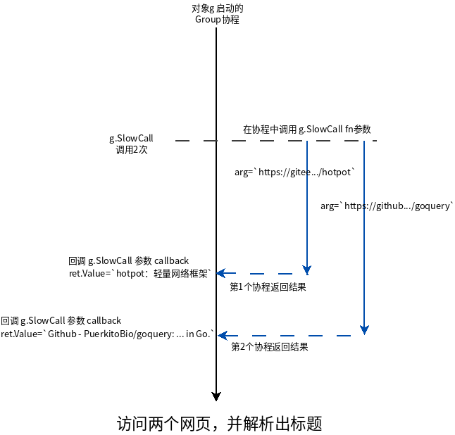

# Group使用说明

## 基本能力

### 聚合通道

聚合通道数据（chan hub），由Group协程串行处理。

```golang

// 自定义数据处理器
// 处理Group中的聚合数据
type Processor struct{}

func (p Processor) Name() string {
    return "MyProcessor"
}

func (p Processor) OnData(data interface{}) interface{} {
    fmt.Println("recv:", data)
    return nil // 次处已经处理完data，不再向后传递
}

func main() {

    // 构建一个组，并设定自定义数据处理函数
    g := hotpot.NewGroup(hub.GroupHandles(&Processor{}))

    // 聚合chan通道
    // 交由Processor.OnData处理
    ch1 := make(chan interface{})
    ch2 := make(chan interface{})
    ch3 := make(chan interface{})
    g.Attach(ch1)
    g.Attach(ch2)
    g.Attach(ch3)

    // 向chan中写入数据
    go func() { ch1 <- 1 }()
    go func() { ch2 <- 2 }()
    go func() { ch3 <- 3 }()

    // wait finished
    ch := make(chan os.Signal, 1)
    signal.Notify(ch, syscall.SIGTERM, syscall.SIGQUIT, syscall.SIGINT)
    <-ch
}
```

[完整示例代码](example/attach/main.go)

### 数据处理队列

Group支持添加多个数据处理器到队列，按照顺序逐个调用。

```golang
// 打印数据处理器
type PrintProcessor struct{}

func (PrintProcessor) Name() string {
    return "Print"
}

func (PrintProcessor) OnData(data interface{}) interface{} {
    fmt.Println("final:", data)
    return nil // 次处已经处理完data，不再向后传递
}

// 翻倍数据处理器
type TimesProcessor struct{}

func (TimesProcessor) Name() string {
    return "Times×2"
}

func (TimesProcessor) OnData(data interface{}) interface{} {
    data = data.(int) * 2
    fmt.Println("Times×2:", data)
    return data // 次处已经处理完data，交给队列后边的处理器，继续处理
}

// 过滤据处理器
type FilterProcessor struct{}

func (FilterProcessor) Name() string {
    return "Filter"
}

func (FilterProcessor) OnData(data interface{}) interface{} {
    if data.(int) == 2 {
        return nil // 丢弃掉2
    }

    fmt.Println("Filter:", data)
    return data // 次处已经处理完data，交给队列后边的处理器，继续处理
}

func main() {

    // 构建一个组，并设定自定义数据处理函数
    g := hotpot.NewGroup(hub.GroupHandles(&TimesProcessor{}, &PrintProcessor{}))

    // 聚合chan通道
    // 交由Processor.OnData处理
    ch1 := make(chan interface{})
    ch2 := make(chan interface{})
    ch3 := make(chan interface{})
    g.Attach(ch1)
    g.Attach(ch2)
    g.Attach(ch3)

    fmt.Println("g.Processors：", g.Processors().String())
    g.Processors().Insert("Times×2", &FilterProcessor{})
    fmt.Println("g.Processors：", g.Processors().String())

    // 向chan中写入数据
    go func() { ch1 <- 1 }()
    go func() { ch2 <- 2 }()
    go func() { ch3 <- 3 }()

    // wait finished
    ch := make(chan os.Signal, 1)
    signal.Notify(ch, syscall.SIGTERM, syscall.SIGQUIT, syscall.SIGINT)
    <-ch
}
```

[完整示例代码](example/processors/main.go)

## 跨协程通讯

### SlowCall - 慢调用

请求两个页面，解析出页面标题，并打印出来。当然，我们希望同时请求这两个页面，以节省时间。这时，可直接使用Group慢调用`SlowCall()`方法实现，思路是：

为每个页面分配协程，获取数据并解析出文档标题，再将结果交给Group协程处理。

[完整示例代码](example/slowcall/main.go)

代码中协程同步模型如下图



在SlowCall中，Group协程将耗时操作放入新协程中处理，并将处理结果汇聚到自身协程中，避免耗时操作导致数据处理排队，提高了数据处理效率。

> 每次调用SlowCall都会启动一个协程，调用fn函数，把arg作为fn的入参；  
> 当fn返回时，返回值通过chan传回到Group协程，Group协程立即调用callback函数，而fn返回值，将作为调用callback的参数传入。

### Event - 事件

通知协程，且不关心处理结果，Group的Event操作实现这样的情形。

```golang
// 主要代码
type G1Processor struct {
    g2 *hub.Group
}

func (p G1Processor) Name() string {
    return "MyProcessor"
}

func (p *G1Processor) OnData(data interface{}) interface{} {
    fmt.Println("recv:", data)
    if data.(int) == 2 {
        // 向g2组发送名为`发现目标`的自定义事件，并附带数据data
        p.g2.Emit("发现目标", data)
    }

    return nil // 次处已经处理完data，不再向后传递
}

func main() {
    g2 := hub.NewGroup()
    g1 := hub.NewGroup(hub.GroupHandles(&G1Processor{g2}))
    // g2组监听自定义事件`发现目标`，并打印出事件附带的数据arg
    g2.ListenEvent("发现目标", func(arg interface{}) {
        fmt.Println("目标", arg, "已被处理！")
    })

    // g1等待数据，如果是2，则通知g2
    ch1 := make(chan interface{})
    g1.Attach(ch1)

    go func() {
        for i := 0; i < 3; i++ {
            ch1 <- i + 1
        }
    }()

// Output:
//  recv: 1
//  recv: 2
//  目标 2 已被处理！
//  recv: 3
}
```

[完整示例代码](example/event/main.go)

使用`Emit()`方法，向Group协程发送事件，最终Group将在自己的协程里，调用`ListenEvent()`注册的函数，作出对事件的实际处理。

我们可以看出Group的事件是异步的，不需要关心事件接收函数的执行结果。有时候，我们需要与Group通讯，并接收其处理结果，这时就需要用到Group的`Call()`方法。

### Call - 调用

```golang
// 主要代码
type G1Processor struct {
    g2 *hub.Group
}

func (p G1Processor) Name() string {
    return "MyProcessor"
}

func (p *G1Processor) OnData(data interface{}) interface{} {
    fmt.Println("recv:", data)
    if data.(int) == 2 {
        waitResult, _ := p.g2.Call("发现目标", data) // 调用g2组绑定的`发现目标`
        tm := time.Now()
        ret := waitResult()                                         // 等待g2调用`发现目标`的返回
        fmt.Println("call spend:", time.Since(tm), ", return:", ret.Value) // 计算本次跨协程调用耗费的事件
    }

    return nil // 次处已经处理完data，不再向后传递
}

func main() {
    g2 := hub.NewGroup()
    g1 := hub.NewGroup(hub.GroupHandles(&G1Processor{g2}))
    // 绑定`发现目标`调用的实现函数
    g2.ListenCall("发现目标", func(arg interface{}) hub.Return {
        fmt.Println("目标", arg, "已被处理！")
        time.Sleep(time.Second) // 延时1秒，模拟耗时操作
        return hub.Return{Value: "ok"}
    })

    // g1等待数据，如果是2，则通知g2
    ch1 := make(chan interface{})
    g1.Attach(ch1)

    go func() {
        for i := 0; i < 3; i++ {
            ch1 <- i + 1
        }
    }()

// Output: 
//  recv: 1
//  recv: 2
//  目标 2 已被处理！
//  call spend: 1.000181503s , return: ok
//  recv: 3
}

```

上面的示例代码输出结果，显示调用实际花费了1秒钟，这意味着g1的协程被阻塞了1秒钟。

[完整示例代码](example/call/main.go)

与`Emit()`方法相比，`Call()`多出了同步返回结果，这意味着它会引发阻塞等待，不过对于HTTP这种一个请求一个协程的情形，等待必要结果是合理的。

另外，Group还提供了延时方法`AfterFunc`，用途同 time.AfterFunc

### AfterFunc - 延时调用

让echo服务器定时广播消息

```golang
// 主要代码

func main() {
    g := hub.NewGroup()
    tm := time.Now()

    g.AfterFunc(time.Second, interval(g, tm))

    // wait finished
    ch := make(chan os.Signal, 1)
    signal.Notify(ch, syscall.SIGTERM, syscall.SIGQUIT, syscall.SIGINT)
    <-ch
}

// 每秒打印一次和开始时间之间的时差
func interval(g *hub.Group, tm time.Time) func() {
    return func() {
        fmt.Println(time.Since(tm))
        g.AfterFunc(time.Second, interval(g, tm))
    }
}

//  Output: 
//  1.000190359s
//  2.000400558s
//  3.000600298s
//  4.000839677s
//  5.001137354s
//  6.001427287s
//  7.001718257s
//  ...
```

代码每隔1秒打印一次距离开始的时间。

[完整示例代码](example/afterfunc/main.go)

实时上，Group的`AfterFunc`方法，基于`SlowCall`实现，将消耗时间的`time.After`操作放在另外的协程中使用，并在超时后，在Group协程里回调callback函数。

### Tick - 定时器

定时调用指定函数，直到返回false时终止。

```golang
// 主要代码

func main() {
    g := hub.NewGroup()
    tm := time.Now()
    g.Tick(time.Second, intervalLess10s(tm))

    // wait finished
    ch := make(chan os.Signal, 1)
    signal.Notify(ch, syscall.SIGTERM, syscall.SIGQUIT, syscall.SIGINT)
    <-ch
}

// 每秒打印一次和开始时间之间的时差，超过10秒，则终止
func intervalLess10s(tm time.Time) func() bool {
    return func() bool {
        since := time.Since(tm)
        if since.Seconds() > 10 {
            return false // 终止
        }

        fmt.Println(since)
        return true // 继续下一次定时调用
    }
}

// Output: 
//  1.000218997s
//  2.000463557s
//  3.00063401s
//  4.000901112s
//  5.00111836s
//  6.001345298s
//  7.001592142s
//  8.001830536s
//  9.002080763s
```

`Tick()`方法简化了重复`AfterFunc()`延时任务的代码书写。

## 设计意图

问：为什么不直接用加锁关键数据，使编程更为直观。

答：不可否认，在协程数量不多时，加锁更为直观，且高效。不过，随着协程数量增加，在同一锁上竞争，导致上下文切换的成本增加，此时锁不再高效。

> 具体参考 [什么是惊群，如何有效避免惊群?](https://www.zhihu.com/question/22756773)

问：采用多个锁，拆分竞争协程，可以有效避免惊群，采用通道似乎没有必要。

答：随着锁的数量增多，同步模型不再清晰，编程复杂度也会增加。采用通道，聚合协程产生的紧耦合数据到一起处理，同步模型清晰，通过公共方法实现常用的同步模型，调用公共方法的业务开发者，几乎感知不到协程数量增加带来的同步问题。

另外，通道的缓冲、阻塞能力，可以提供更高效的并发和流控，这是锁同步无法轻易代替的。
